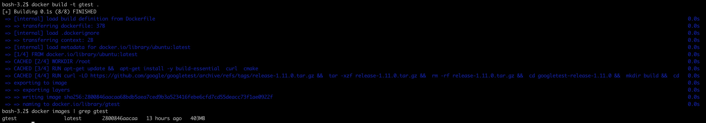
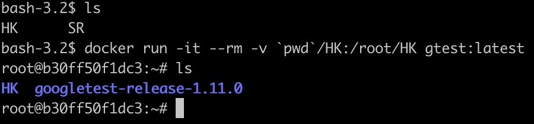

# Container for Gtest

## Docker Image Build
**command**
```
docker build -t <NAME> .
```
`Dockerfile`을 이용해 이미지를 빌드해야합니다. \
`NAME`부분에 사용하려는 이름을 적어주세요.

**example**


## Docker Run
**command**
```
docker run -it --rm -v <local의 디렉토리 위치>:<Container의 디렉토리 위치> <NAME>:latest
```
컨테이너를 실행시 `bind mount`를 이용해 테스트하려는 소스코드가 있는 디렉토리를 마운트 합니다. \
`docker image`의 이름을 `NAME`에 적어주세요.

**example**


## 빌드 스크립트 작성
**directory struct example**
```
├── main.cc
├── sum.cc
├── sum_test.cc
└── sum.h
```
```
// Makefile
all:
	g++ -o main main.cc sum.cc
test:
	g++ -o sum_test sum_test.cc sum.cc -pthread -lgtest -std=c++11
	./sum_test
```